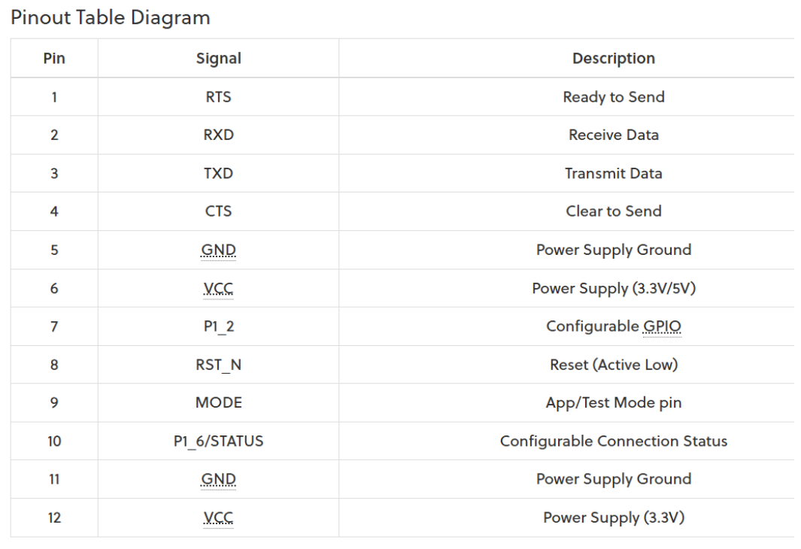

# 01 — Vivado Block Design

**Tool:** Vivado 2025.2.1  
**Vivado 2025 differences:** Minor — no behavioral differences from standard flow; follow steps as written.

---

## Overview

Create a Vivado RTL project targeting the ZedBoard, add the ZYNQ7 Processing System IP, configure UART0 on MIO 10/11 (JE connector), and export the hardware platform (`.xsa`) for Vitis. No PL logic is required — the entire UART bridge runs in the PS.

---

## Key Concepts

- **PS (Processing System):** The ARM Cortex-A9 side of the Zynq SoC. Runs C code. Has dedicated UART controllers hardwired to MIO pins.
- **PL (Programmable Logic):** The FPGA fabric side. JA–JD Pmod connectors route here. Not used in this project.
- **MIO (Multiplexed I/O):** Fixed-function PS I/O pins. UART0 is hardwired to MIO 10/11. Cannot be reassigned via constraints.
- **JE:** The only PS-connected Pmod on the ZedBoard. Required for this project. JA–JD are PL only and cannot carry PS UART signals.
- **EMIO:** An alternative that routes PS signals through PL to other pins. Not used here — adds latency and risk with no benefit since JE is available.
- **HDL Wrapper:** Auto-generated Verilog/VHDL that wraps the block design so the synthesizer can process it.
- **XSA:** Hardware export file. Consumed by Vitis to understand what peripherals are available and at what addresses.

---

## Vivado 2025 Differences

No differences from standard Zynq PS block design flow. Follow steps as written.

---

## Steps

### Project Creation

1. Create the following folder structure before opening Vivado:
   ```
   TeraTerm_ZedBoard_PmodBLE/
   ├── vivado/     ← Vivado project goes here
   └── ws/         ← Vitis workspace goes here
   ```

2. In Vivado: **File → New Project**. Select the `vivado` folder as the project location.

3. Select project type: **RTL Project**.

4. Press **Next** through source/constraints pages (nothing to add yet).

5. On the board selection page: **Boards → ZedBoard Zynq Evaluation and Development Kit** → **Next → Finish**.

### Block Design

6. **Flow Navigator → IP Integrator → Create Block Design**. Accept the default name → **OK**.

7. Press **`+`** to add IP. Search for and select **ZYNQ7 Processing System**.

8. Click **Run Block Automation** → leave all defaults → **OK**.

9. Connect `FCLK_CLK0` to `M_AXI_GPO_ACLK` manually by dragging between the ports.

### UART0 Configuration

10. Double-click the **ZYNQ7 Processing System** block to open its configuration.

11. Navigate to **MIO Configuration → I/O Peripherals**.

12. Enable **UART 0**. In the pin dropdown, select **MIO 10 / 11**.

    > **Why MIO 10/11:** These are the PS-hardwired UART0 pins that physically connect to JE pins 2 and 3 on the ZedBoard. MIO 10 = RX (JE2), MIO 11 = TX (JE3). Voltage is 3.3V — correct for Pmod BLE.

    > **Slow slew rate on MIO 10/11** reduces the chance of signal integrity issues and missed data at 115200 baud over jumper wires.

13. Click **OK**.

### Validation and Synthesis

14. Right-click on white space in the Diagram tab → **Validate Design**. Expect no errors. Click **OK**.

15. Save the block design (Ctrl+S or save icon).

16. In the **Sources** tab: **Design Sources → `design_1`** (or your block design name) → right-click → **Create HDL Wrapper** → **Let Vivado manage** (default) → **OK**.

    Result: `design_1_wrapper.v` appears under Design Sources.

17. **Flow Navigator → SYNTHESIS → Run Synthesis** → default settings → **OK**.

    > Synthesis takes several minutes. Monitor progress in the **Design Runs** tab.

18. When synthesis completes, select **Open Synthesized Design** from the pop-up → **OK**.

19. In the pin view, confirm JE2 and JE3 (G7/B4) show as in-use for MIO 10/11. This is informational — no action needed.

### Bitstream and Export

20. In the **Design Runs** tab: right-click `impl_1` → **Generate Bitstream** → **OK** (default settings).

    > When bitstream generation completes, dismiss both pop-ups with **OK**.

21. **File → Export → Export Hardware**.
    - Select: **Include bitstream**
    - **Next → Next → Finish**

    > The `.xsa` file is written to the `vivado` project folder. This is the file Vitis needs.

*Vivado work is complete.*

---

## Debug Notes

- No issues encountered during Vivado setup for this project.
- If synthesis fails to launch via GUI button, see [troubleshooting.md](troubleshooting.md) for the Tcl console workaround (`reset_run synth_1; launch_runs synth_1 -jobs 2`).

---

## Observed Results / Screenshots



