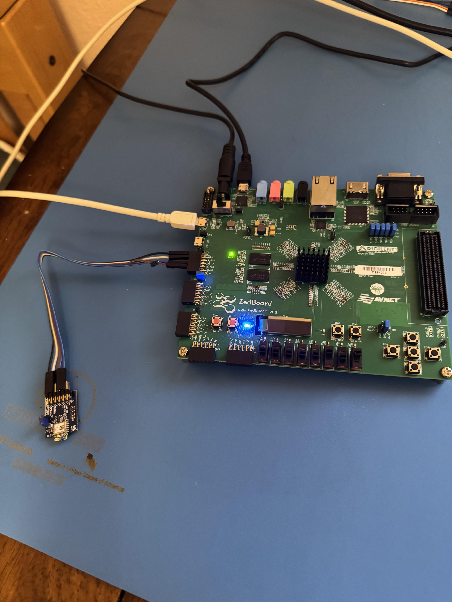

# 03 — Hardware Setup

**Vivado 2025 differences:** Not applicable — hardware wiring only.

---

## Overview

Configure the ZedBoard boot jumpers, wire the Pmod BLE to JE with TX/RX crossed using jumper wires, and connect power and USB cables. This must be done before running the Vitis application.

---

## Key Concepts

- **JTAG Boot Mode:** ZedBoard boots from JTAG, allowing Vitis to program the PS directly. Set by pulling J7–J11 to GND.
- **JE Connector:** The only PS-connected Pmod on the ZedBoard. Has MIO 10 (RX, pin JE2) and MIO 11 (TX, pin JE3).
- **TX/RX Cross:** UART requires TX of one device to connect to RX of the other. Plugging Pmod BLE directly into JE creates TX→TX and RX→RX — which does not work. Jumper wires must cross the lines.
- **3.3V logic:** Pmod BLE operates at 3.3V. MIO 10/11 is also 3.3V. Verified compatible.

---

## Vivado 2025 Differences

Not applicable.

---

## Steps

### ZedBoard Boot Jumpers

1. Set **J7 through J11 to GND** (JTAG boot and configuration mode).
   - This allows Vitis to program the board over USB.

2. Connect:
   - **J17** — USB-UART cable (to PC, this is the Tera Term COM port)
   - **J14** — USB-UART (second USB; used by Vitis for JTAG programming)
   - **Power cable**

### Pmod BLE Wiring

> **Do not plug the Pmod BLE directly into the JE socket.** Doing so connects TX→TX and RX→RX, which does not communicate. Use female-to-male jumper wires with the TX and RX lines crossed.

Use **female-to-male jumper wires**:

| Pmod BLE Pin | Signal | JE Pin | ZedBoard Signal |
|:-------------|:-------|:-------|:----------------|
| Pin 6 or 12 | VCC | JE6 or JE12 | VCC (3.3V) |
| Pin 5 or 11 | GND | JE5 or JE11 | GND |
| **Pin 2** | **RX** | **JE3** | **MIO 11 — TX** |
| **Pin 3** | **TX** | **JE2** | **MIO 10 — RX** |

> RX → TX and TX → RX. The cross is intentional and required.

### Power On

3. Turn on ZedBoard (SW8).
4. Confirm: blue LED on Pmod BLE blinks — this indicates the module has power.

---

## Debug Notes

- If the blue LED on Pmod BLE does not blink: check VCC and GND connections first.
- If the bridge runs but BLE does not respond to `$$$`: the most common cause is TX/RX not crossed. Verify pin 2 (RX on BLE) goes to JE3 (TX on ZedBoard) and pin 3 (TX on BLE) goes to JE2 (RX on ZedBoard).
- **Do not hot-plug the Pmod BLE** (connect or disconnect while the ZedBoard is powered on). Always power off the ZedBoard before changing wiring.
- **If Pmod BLE does not power on when the ZedBoard turns on:** turn off the ZedBoard (SW8), unplug the VCC jumper wire from JE, wait 3–5 seconds, plug VCC back in, then power on the ZedBoard again.

---

## Observed Results / Screenshots

*Notice the jumper wires are crossed between Pmod BLE and JE. This is correct.*
