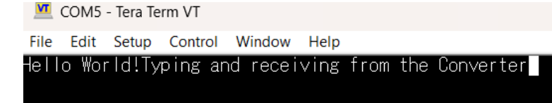
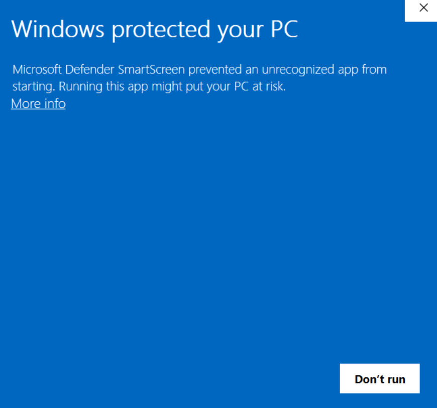
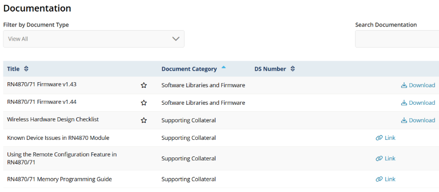
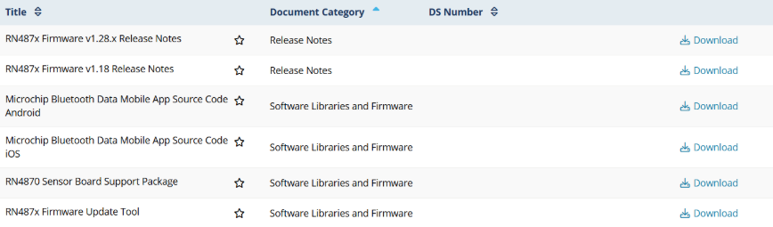
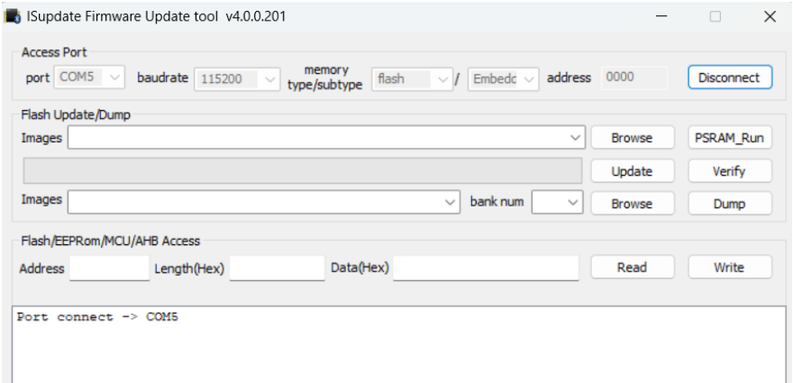
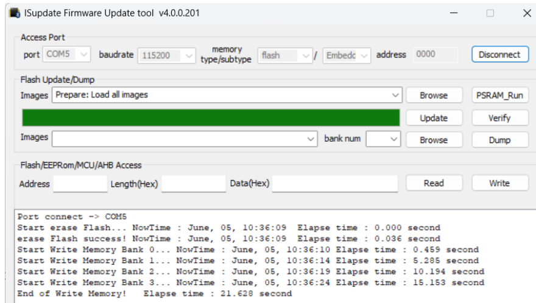

# 04 — USB-to-TTL Converter Testing & RN4871 Firmware Update

**Vivado 2025 differences:** Not applicable — standalone hardware/firmware procedure.

---

## Overview

Two independent procedures covered here:

1. **Test the USB-to-TTL converter** in loopback mode to confirm it works before connecting to the Pmod BLE.
2. **Update the RN4871 firmware** from old factory firmware (e.g., v1.18.3) to v1.44 or newer, which is required for reliable BLE operation.

This setup is also used as the primary PC-direct interface to Pmod BLE for all BLE configuration commands, independent of the ZedBoard.

---

## Key Concepts

- **USB-to-TTL Converter:** Hardware: DSD TECH SH-U09C5. Converts USB to 3.3V or 5V UART signals. **Must be set to 3.3V** for Pmod BLE.
- **Loopback test:** Shorting TXD to RXD on the converter causes it to echo back anything sent. Used to verify the converter and Tera Term are working before involving the Pmod BLE.
- **RN4871 firmware:** The Pmod BLE ships with older firmware that may have broken or missing BLE commands. v1.44 or newer is required for reliable BLE operation (v1.44 is the latest stable as of 2026).
- **Test/Boot mode:** Shorting J1 on the Pmod BLE pulls the MODE pin low, placing the RN4871 into firmware update mode. The blue LED stays solid (not blinking) in this mode.
- **`isupdate.exe`:** Microchip's firmware update tool. Requires `.H##` hex files from the firmware package.

---

## Vivado 2025 Differences

Not applicable.

---

## Procedure 1: USB-to-TTL Converter Loopback Test

Do this first, before connecting any other hardware.

1. **Leave the short installed over the TXD and RXD pins** on the converter. This creates the loopback — everything sent is echoed back.

2. Plug the converter into the PC USB port. Windows should install the driver automatically.

3. Open **Device Manager → Ports (COM & LPT)** to confirm the assigned COM port.

4. Open **Tera Term**:
   - Select the converter's COM port.
   - Baud rate: **9600** (converter default for loopback test).
   - **Setup → Terminal → Local Echo: OFF.**

5. Type in the terminal. Characters should appear as you type (echoed by the loopback short).

6. TX and RX LEDs on the converter should blink when typing.

   > If nothing appears: check COM port, baud rate, and that the short is installed over TXD/RXD.

---

## Procedure 2: Test Pmod BLE with USB-to-TTL Converter

Complete Procedure 1 first.

> **Safety — do this before connecting any wires:**  
> Set the **voltage jumper on the converter to 3.3V** while the converter is unplugged.  
> Pmod BLE is a 3.3V device. 5V logic will damage it.  
> Double-check wiring before plugging in — a VCC/GND short will likely damage the module.

### Wiring (female-to-female jumper wires)

| TTL Converter | Pmod BLE |
|:--------------|:---------|
| VCC | VCC (pin 6 or 12) |
| GND | GND (pin 5 or 11) |
| TXD | RX (pin 2) |
| RXD | TX (pin 3) |

- RTS and CTS on the converter are not connected.
- Remove the loopback short from TXD/RXD before wiring to Pmod BLE.

### Test Steps

1. Set converter voltage jumper to **3.3V** (converter unplugged).
2. Wire Pmod BLE to converter per table above.
3. Verify all wiring before proceeding.
4. Plug converter into PC.
5. Blue LED on Pmod BLE should blink — power confirmed.
6. Open Tera Term:
   - Select the converter's COM port.
   - Baud rate: **115200** (Pmod BLE default — different from converter loopback test baud).
7. Wait ~1 second, then type `$$$`.
8. Pmod BLE should respond with `CMD>`.

   > **`$$$` is the only RN4871 command that does not require pressing Enter.** All other commands (e.g., `SS,C0`, `R,1`, `D`, `V`) must be followed by Enter to execute. Pressing Enter after `$$$` will send a carriage return that may be interpreted as an empty command — type `$$$` and stop.

   > **Tip:** When typing, the TX LED on the converter blinks. When Pmod BLE responds, the RX LED blinks.

---

## Procedure 3: Windows Security Scan for Downloaded Files

Microchip's `isupdate.exe` may trigger a Windows security warning. To verify the file:

1. Press **Windows key** → search **Windows Security**.
2. Go to **Virus & Threat Protection → Scan options → Custom Scan → Scan now**.
3. Select the folder containing the downloaded file.
4. Review results. If clean, proceed.
5. If Windows still blocks the file: **More info → Run anyway** (only after confirming the file is from the official Microchip source).

Only download firmware and tools from: [Microchip RN4870/1 Documentation Page](https://www.microchip.com/en-us/product/RN4870#Documentation).

---

## Procedure 4: Update RN4871 Firmware to v1.44 or Newer

Reference: [Firmware Update Tutorial — martyncurrey.com](https://www.martyncurrey.com/arduino-with-rn48701/)

### Check Current Version

1. Enter command mode via Tera Term (Pmod BLE connected via USB-TTL): `$$$`
2. Enable echo: `+` (ECHO ON)
3. Type `V` → note the version string.
   - Old example: `V1.18.3`
   - Target: `V1.44`

If already on v1.44 or newer, skip the update.

### Update Steps

1. **Power off Pmod BLE** (unplug USB-TTL converter from PC).

2. **Short J1** on the Pmod BLE (the two-pin header). This pulls the MODE pin low and enables firmware update (test/boot) mode.

3. Wire Pmod BLE to USB-TTL converter (same wiring as Procedure 2).

4. Plug converter into PC.

5. Blue LED should be **solid on** (not blinking). Solid = test/boot mode confirmed.

6. Note the COM port in Device Manager.

7. Download from [Microchip RN4870/1 Documentation Page](https://www.microchip.com/en-us/product/RN4870#Documentation):
   - Latest firmware package (contains `.H##` hex files in a `Hex_Files` folder)
   - **RN487x Firmware Update Tool** (contains `isupdate.exe`)

8. Run `isupdate.exe`. (Run Windows Security scan first if warned.)

9. In the updater UI:
   - COM port: select the converter's port
   - Baud rate: **115200**
   - Memory: **Flash / Embedded Flash**
   - Address: **0000**

10. Click **Connect**. Expect: `Port connect -> COM#`

11. Click **Browse** and select all `.H##` files from the `Hex_Files` folder of the firmware package.

12. Click **Update**. Wait for `End of Write Memory` message.

13. Click **Disconnect** and close `isupdate.exe`.

14. Unplug the converter from PC (this powers off Pmod BLE).

15. **Remove the J1 short.**

16. Reconnect normally (plug converter back in).

17. Verify: `$$$` → `V` → should display:
    ```
    RN4871 V1.44 06/21/2024 (c)Microchip Technology Inc
    ```

---

## Debug Notes

- No bugs encountered during firmware update. Process worked as documented above.
- If `isupdate.exe` cannot connect: verify COM port, baud rate, and that J1 short is installed before powering on.
- If blue LED blinks instead of staying solid: J1 short is not making contact — check the short placement.

---

## Observed Results / Screenshots







