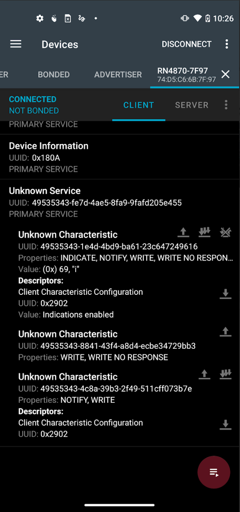
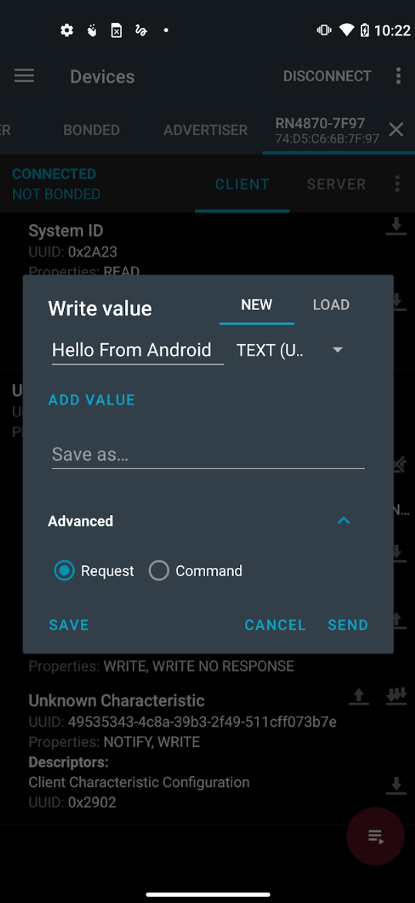
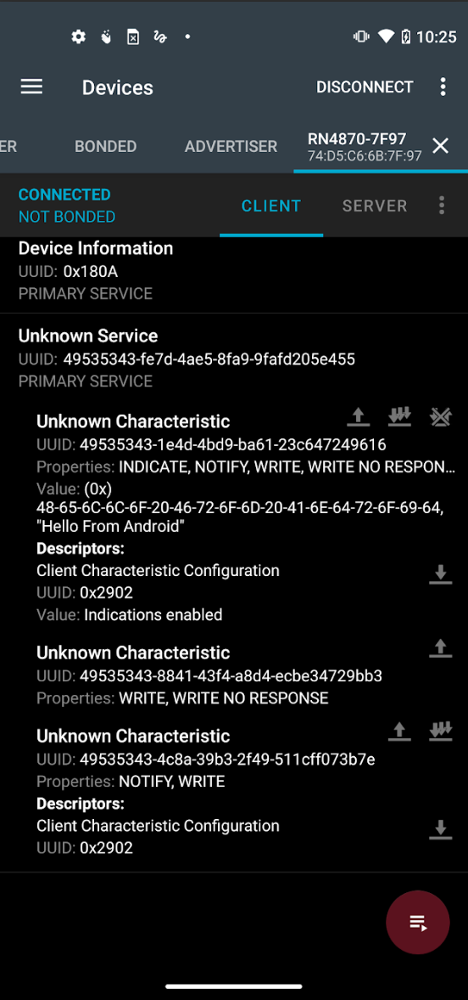

# 05 — Pmod BLE ↔ Android Connection (nRF Connect)

**Vivado 2025 differences:** Not applicable — BLE/app procedure only.

---

## Overview

Configure the RN4871 with the UART Transparent Service, then use nRF Connect for Mobile (Android) to connect, send data from the phone to Tera Term, and receive data from Tera Term on the phone.

This procedure works with either the USB-TTL direct setup (doc 04) or the ZedBoard UART bridge (docs 01–03). The RN4871 commands are the same in either case.

---

## Key Concepts

- **UART Transparent Service:** A BLE profile built into the RN4871 that exposes a write/notify characteristic, enabling raw byte streaming over BLE. Must be explicitly enabled with `SS,C0`.
- **`SS,C0`:** Enables Device Information Service (`0x80`) + UART Transparent Service (`0x40`) = `0xC0`. Without this, nRF Connect connects but shows no writable BLE characteristic.
- **nRF Connect:** Nordic Semiconductor's BLE debug app. Used here as the phone-side BLE terminal. Available on Android and iOS.
- **Unknown Service / Unknown Characteristic:** How nRF Connect labels the UART Transparent Service — it doesn't have a standard GATT UUID so the app cannot name it. This is normal.
- **Indicate vs Notify:** The UART Transparent characteristic supports both. Enabling indications (two-arrows icon) allows the phone to receive data from the RN4871.

---

## Vivado 2025 Differences

Not applicable.

---

## Steps

### Prerequisites

- Pmod BLE powered and connected to PC via USB-TTL converter (doc 04) or ZedBoard UART bridge (docs 01–03).
- Tera Term open at 115200 baud on the correct COM port.
- nRF Connect for Mobile installed on Android phone.
- Bluetooth enabled on phone.

### Configure RN4871 (if not already done)

Only do this once. Settings persist across power cycles after reboot.

1. In Tera Term, enter command mode:
   ```
   $$$
   ```
   Response: `CMD>`

2. Factory reset (optional — do this if the module was previously in an unknown state):
   ```
   SF,1
   ```
   Then reboot:
   ```
   R,1
   ```
   Wait for module to restart, re-enter command mode: `$$$`

3. Enable UART Transparent Service:
   ```
   SS,C0
   ```

4. Reboot to apply:
   ```
   R,1
   ```

5. Re-enter command mode and verify configuration:
   ```
   $$$
   D
   A
   ```
   Confirm `Services=C0` in the output. Note the device name (e.g., `RN4870-XXXX`). `A` starts advertising so the phone can discover the module.

6. Exit to data mode:
   ```
   ---
   ```

### Connect with nRF Connect (Android)

7. Open **nRF Connect for Mobile** on Android.
8. Tap **Scan**.
9. Find the device name noted from the `D` command.
10. Tap **Connect**.

11. Tera Term displays connection messages:
    ```
    %CONNECT,1,XXXXXXXXXXXX%
    %CONN_PARAM,0006,0000,01F4%
    %CONN_PARAM,0024,0000,01F4%
    ```

### Enable Receive (Phone ← RN4871)

12. In nRF Connect, scroll to the **Unknown Service**.
13. Find the **Unknown Characteristic** with properties: Indicate, Notify, Write, Write Without Response.
14. Tap the **two-arrows icon** (indications/notifications). An X appears over the icon when enabled.
15. Under Descriptors: confirms `Indications enabled`.

The phone can now receive data from the RN4871.

### Send Data: Android → Tera Term

16. Tap the **up-arrow icon** (write) on the characteristic.
17. Select format: **UTF-8**.
18. Type a message, e.g.:
    ```
    Hello From Android
    ```
19. Under Advanced, select **Request**.
20. Tap **Send**.

21. The message appears in Tera Term:
    ```
    Hello From Android
    ```

### Send Data: Tera Term → Android

22. Type any text in Tera Term. The RN4871 transmits character by character over BLE.
23. nRF Connect shows the most recently received character/value under **Value** on the Unknown Characteristic.

    > The display in nRF Connect updates per-character, not per-message. The full string accumulates as characters arrive.

---

## Debug Notes

- If nRF Connect connects but shows no Unknown Service / writable characteristic: `SS,C0` was not applied, or the module was not rebooted after `SS,C0`. Re-run the configure steps.
- If `$$$` gets no response: verify baud rate is 115200, TX/RX wiring is correct, and Pmod BLE is powered.
- If the phone cannot find the device during scan: verify the module is advertising. Enter command mode (`$$$`) and send `A` to start advertising before scanning. The module does not advertise automatically after every reboot.
- First `$$$` after the previous Tera Term session on the same connection may require pressing Enter first.

---

## Observed Results / Screenshots




