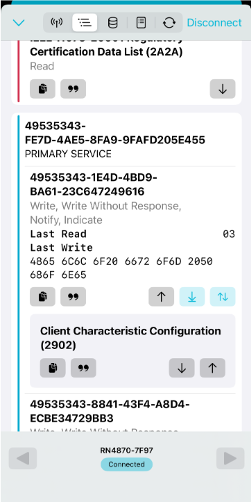
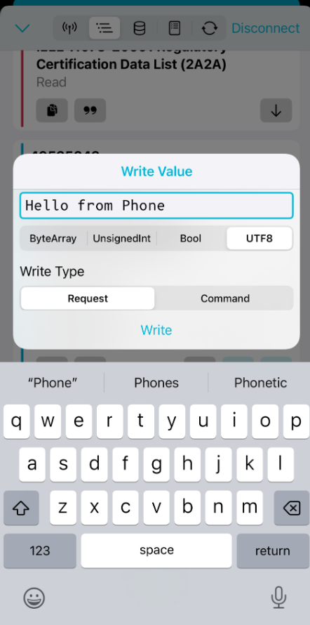
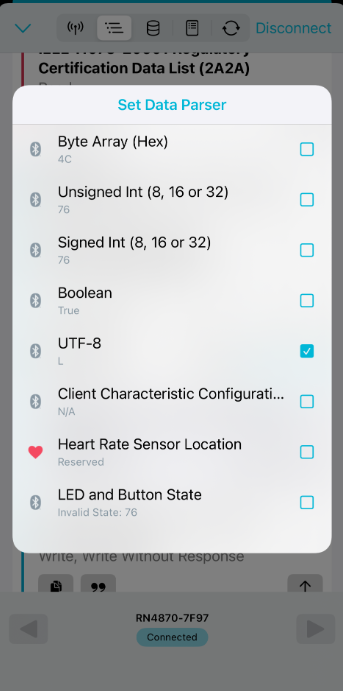
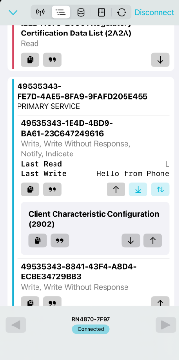

# 06 — Pmod BLE ↔ iOS Connection (nRF Connect)

**Vivado 2025 differences:** Not applicable — BLE/app procedure only.

---

## Overview

Connect an iOS device to the RN4871 using nRF Connect for Mobile (iOS). The RN4871 configuration is the same as Android (doc 05). The differences are in the nRF Connect iOS UI and the data format selection workflow.

---

## Key Concepts

- **nRF Connect iOS:** Same core functionality as Android version, but UI layout differs. Characteristic icons and descriptor interaction are slightly different.
- **`%STREAM_OPEN%`:** Tera Term output that appears when a BLE data stream connection is established after the phone enables the UART Transparent characteristic. Indicates the data channel is open and bidirectional transfer is active.
- **Client Characteristic Configuration (CCC):** The descriptor under the UART Transparent characteristic. Tap the `"` icon to set data display format (UTF-8 recommended for text).
- **Last Read:** The field in nRF Connect iOS that shows the most recently received character or value from the RN4871. Updates per-character.

---

## Vivado 2025 Differences

Not applicable.

---

## Steps

### Prerequisites

- Pmod BLE powered and connected to PC via USB-TTL converter (doc 04) or ZedBoard UART bridge (docs 01–03).
- Tera Term open at 115200 baud.
- RN4871 already configured with `SS,C0` (see doc 05 — configure steps are identical).
- nRF Connect for Mobile installed on iOS device.
- Bluetooth enabled on iPhone.

### Configure RN4871 (if not already done)

Follow the same configuration steps as doc 05:

```
$$$
SS,C0
R,1
$$$
D       ← note device name
A       ← start advertising
---     ← exit to data mode
```

Confirm `Services=C0` in the `D` output.

### Connect with nRF Connect (iOS)

1. Open **nRF Connect for Mobile** on iPhone.
2. Scan for BLE devices.
3. Tap **Connect** on the device name from the `D` command (e.g., `RN4870-XXXX`).

4. Pmod BLE LED blinks twice repeatedly — indicates active BLE connection.

5. Tera Term displays:
   ```
   %CONNECT,1,48DD72EC55DD%
   ```

### Enable Data Stream (Phone ← RN4871)

6. In nRF Connect iOS, explore services and locate the **PRIMARY SERVICE** with properties: Write, Write Without Response, Notify, Indicate.

7. Tap the **two-arrows icon** (opposite directions). It turns blue when enabled.

8. Tera Term displays:
   ```
   %STREAM_OPEN%%CONN_PARAM,0018,0000,0200%
   ```
   `%STREAM_OPEN%` confirms the BLE data channel is active.

### Send Data: iOS → Tera Term

9. Tap the **up-arrow icon** (write) on the characteristic.
10. Type a message:
    ```
    Hello from Phone
    ```
11. Select format: **UTF-8**.
12. Select type: **Request**.
13. Tap **Write**.

14. Tera Term displays:
    ```
    Hello from Phone
    ```

### Configure Data Display Format on Phone

15. Tap **`"`** icon under **Client Characteristic Configuration**.
16. Select **UTF-8** as the data format.
17. Repeat for the **`"`** icon under **Last Write**.

This ensures received data renders as readable text rather than hex.

### Send Data: Tera Term → iOS

18. Type any text in Tera Term. Data is transmitted character by character.
19. The most recently received character appears under **Last Read** in nRF Connect iOS.

    > Same per-character behavior as Android — the value field updates with each character received.

---

## Tips

- Enable **Local Echo** in Tera Term (Setup → Terminal → Local Echo: ON) if you cannot see what you are typing. This is separate from the bridge echo in `main.c`.
- Always use **UTF-8** for text data. Other formats will display hex.

---

## Debug Notes

- If `%STREAM_OPEN%` does not appear after tapping the two-arrows icon: try disconnecting and reconnecting, then tapping the icon again.
- If the phone connects but data does not flow: verify `SS,C0` was applied and the module rebooted after. Verify the two-arrows icon is blue (active).
- iOS and Android nRF Connect behave identically at the protocol level — if one works and the other doesn't, the issue is in the app UI interaction, not the RN4871 configuration.

---

## Observed Results / Screenshots





